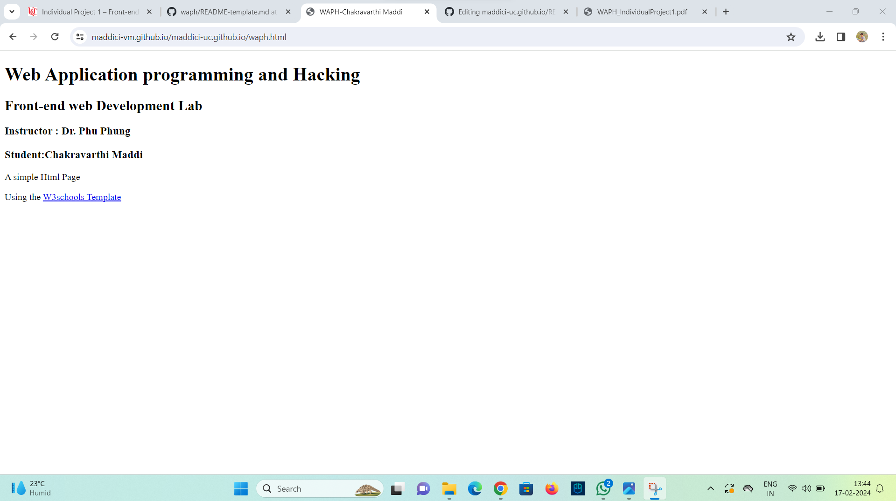
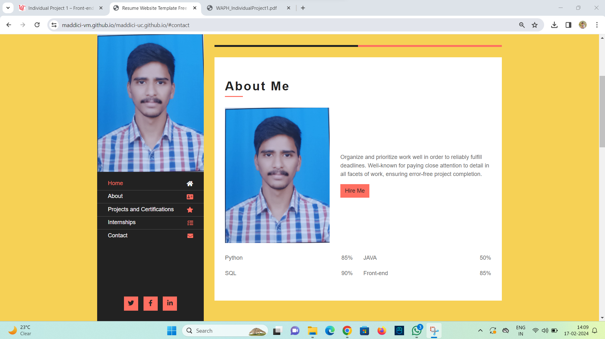
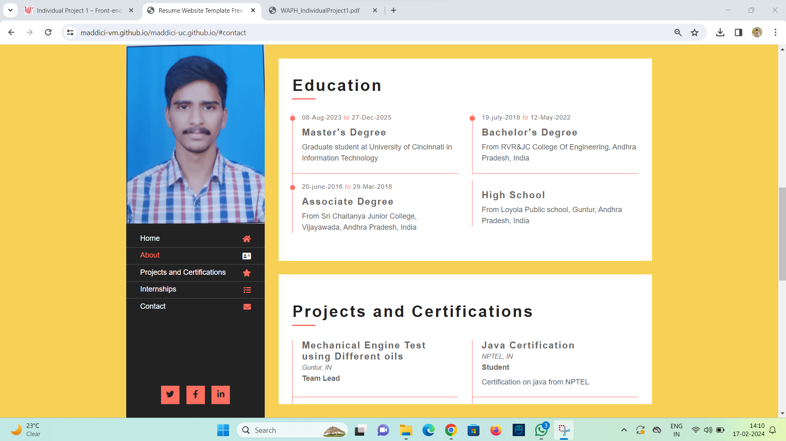
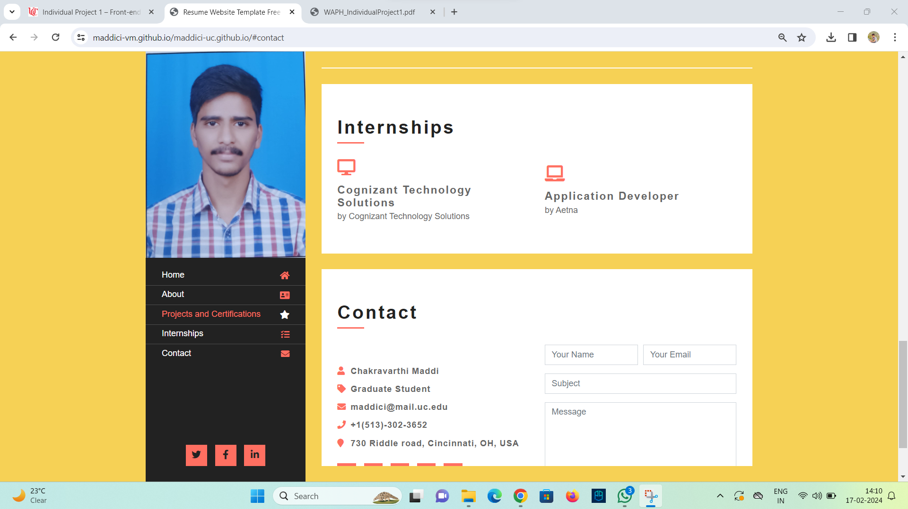
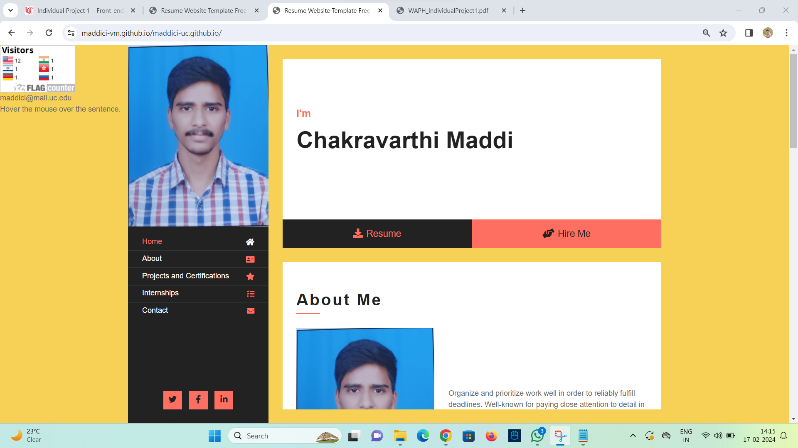

# WAPH-Web Application Programming and Hacking

## Instructor: Dr. Phu Phung

## Student

**Name**: Chakravarthi Maddi

**Email**: maddici@ucmail.uc.edu

**Short-bio**:  Aspiring IT graduate student passionate about leveraging technology to drive innovation 

## Repository Information

Respository's URL: [https://github.com/maddici-vm/maddici-uc.github.io/)

[https://maddici-vm.github.io/maddici-uc.github.io/index.html)

In Screeonshot-1 , generated a waph-html

